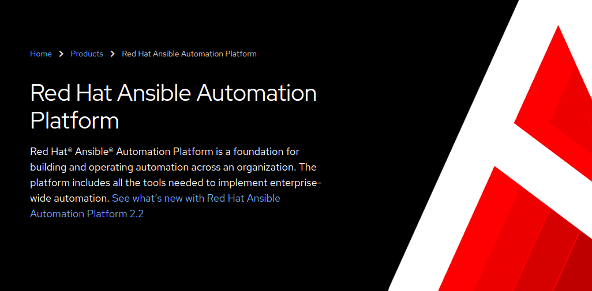
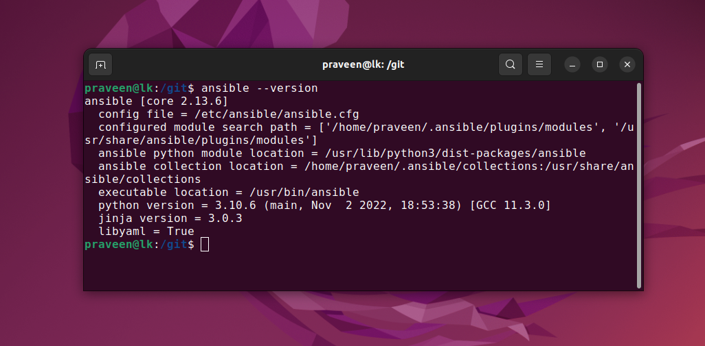

# RedHat Ansible


https://www.redhat.com/en/technologies/management/ansible

Build, provision, and manage applications and infrastructure across public or private cloud, containers, and virtual environments.

Automate your application deployments and make your installations, upgrades, and day-to-day management repeatable and reliable.



# Install Ansible

```
sudo apt-add-repository ppa:ansible/ansible
sudo apt update
sudo apt install ansible
```



