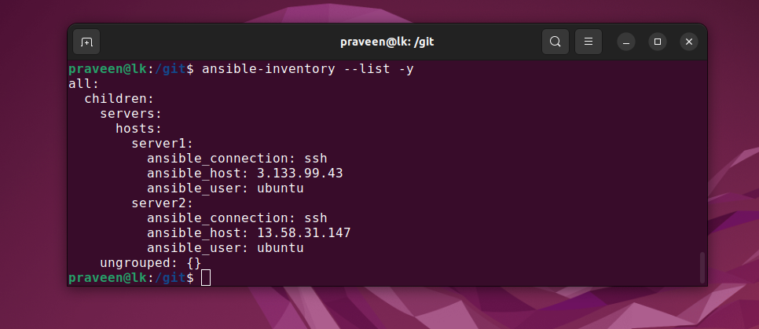
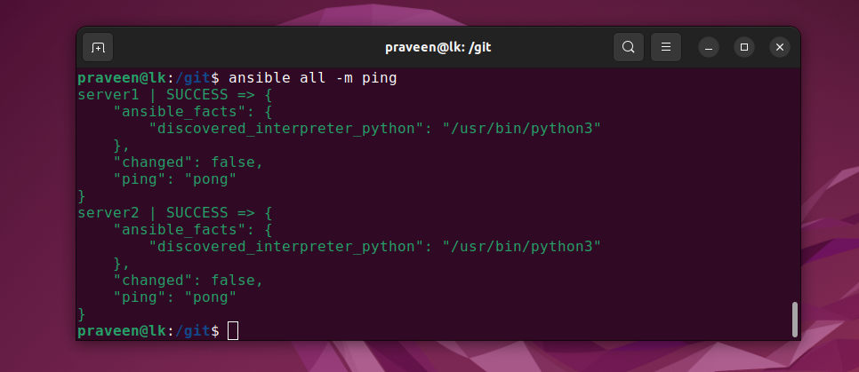
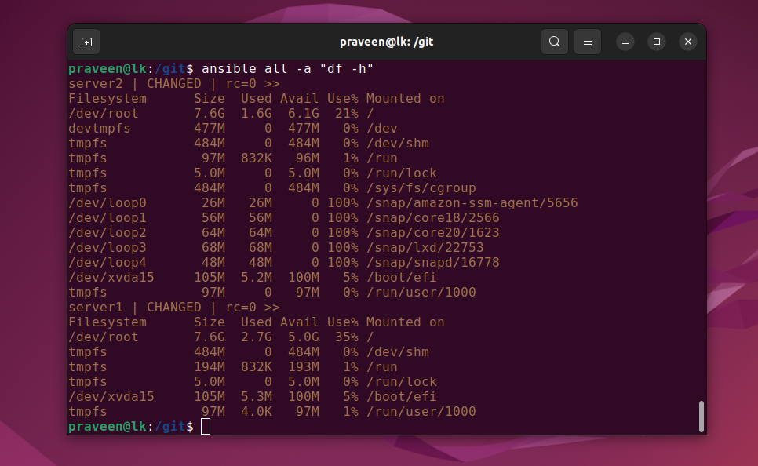
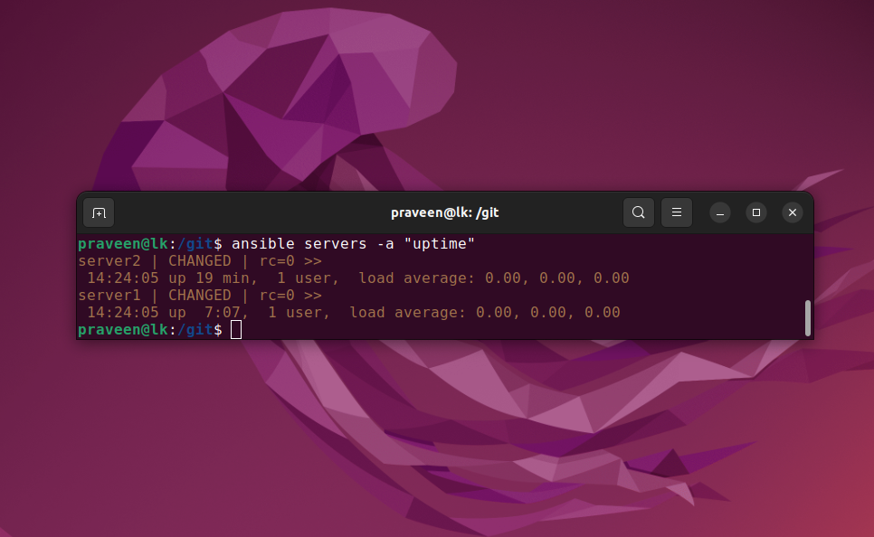

# RedHat Ansible


https://www.redhat.com/en/technologies/management/ansible

Build, provision, and manage applications and infrastructure across public or private cloud, containers, and virtual environments.

Automate your application deployments and make your installations, upgrades, and day-to-day management repeatable and reliable.


# Install Ansible

```
sudo apt-add-repository ppa:ansible/ansible
sudo apt update
sudo apt install ansible
```


# Ansible Inventory

`sudo nano /etc/ansible/hosts`



## Ansible Hosts on AWS


# Ansible Connection Testing



# Ansible Commands

# Execute ad-hoc commands from an Ansible Control Node



